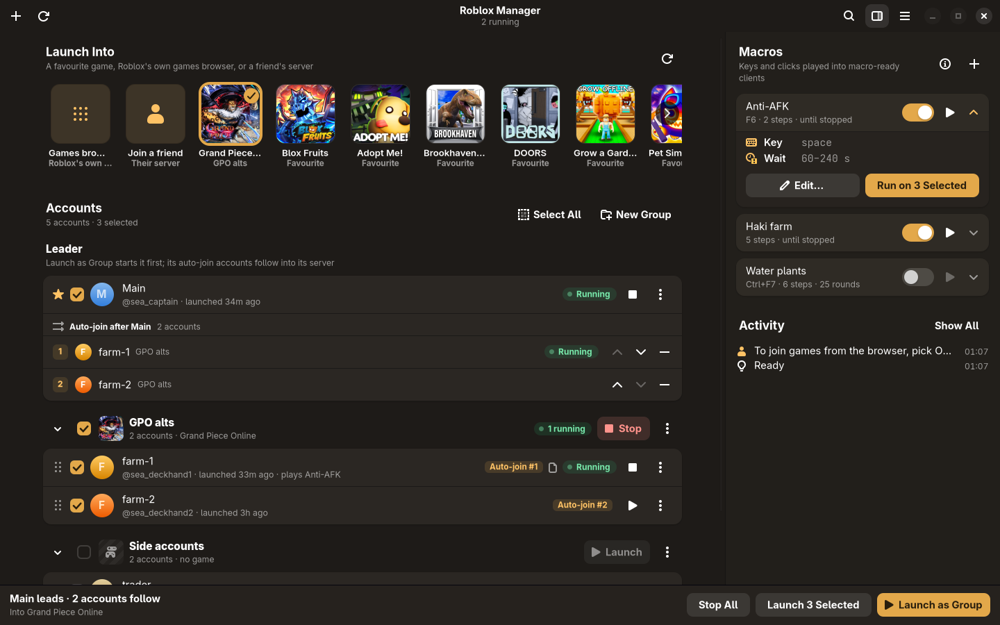
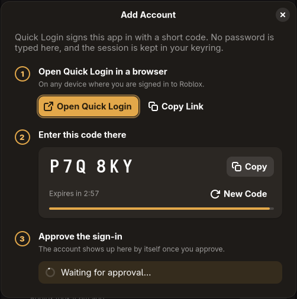
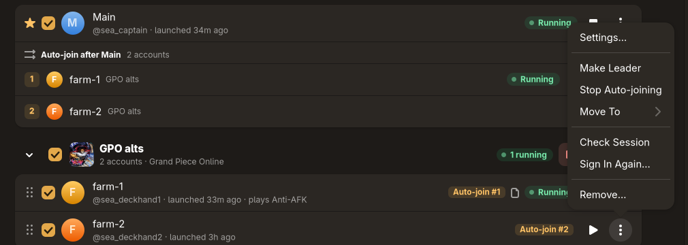
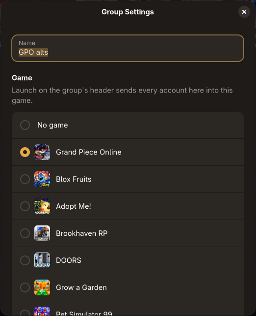
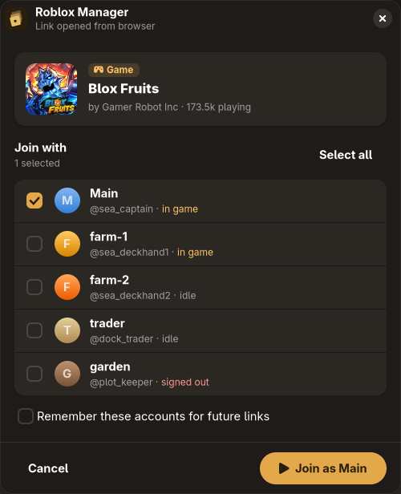
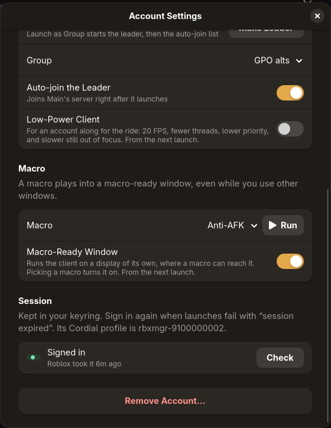
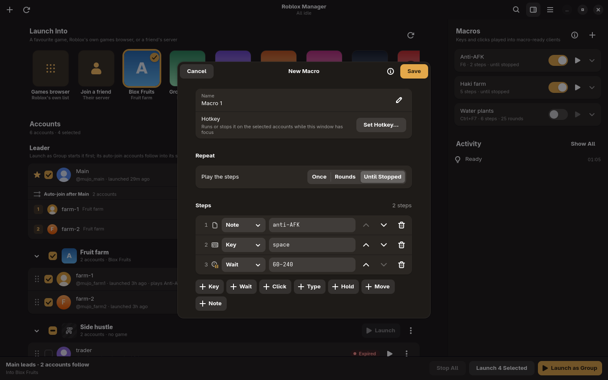
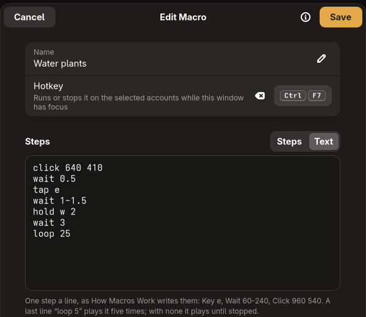
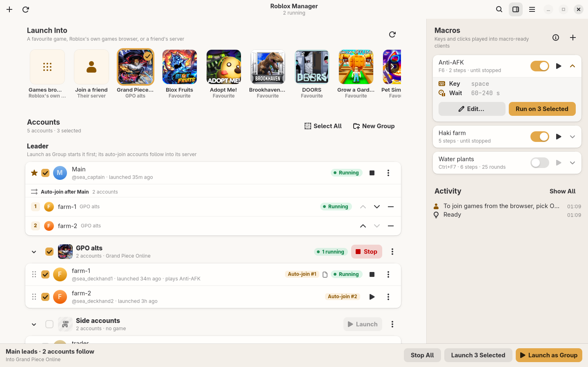

# Roblox Manager

Run several Roblox accounts on Linux and put them in the same server.



You sign each account in once, then launch them all with one click. One
account goes first as the leader, and the rest join whatever server it lands
in. The app also handles the Play button on roblox.com, and it can run simple
key-and-click macros on an account while you use your desktop for something
else.

Roblox itself runs in [Cordial](cordial/README.md), a runtime for Roblox's
official Android build. The manager installs and updates it for you.

> [!WARNING]
> Roblox's terms don't allow running more than one client at once, and people
> have reported anti-cheat flags for it. Installing the app does nothing on its
> own. The risk starts when you launch a second client, and that only happens
> when you click Launch. Use alts you can afford to lose.

**Contents:** [Install](#install) ·
[Add an account](#add-an-account) ·
[Launch](#launch-into-a-game) ·
[Leader and auto-join](#leader-and-auto-join) ·
[Groups](#groups) ·
[Links from the website](#joining-from-the-website) ·
[Account settings](#account-settings) ·
[Macros](#macros) ·
[Updates](#updates) ·
[Shortcuts](#keyboard-shortcuts) ·
[Troubleshooting](#troubleshooting)

## Install

Download a package from the
[latest release](https://github.com/DamnShabu/roblox-manager/releases/latest)
(x86_64 only):

| Distro | File | Install |
| --- | --- | --- |
| Debian, Ubuntu, Mint, Pop!_OS | `roblox-manager_*_amd64.deb` | `sudo apt install ./roblox-manager_*_amd64.deb` |
| Fedora, openSUSE | `roblox-manager-*.x86_64.rpm` | `sudo dnf install ./roblox-manager-*.x86_64.rpm` |
| Arch, Manjaro | `roblox-manager-*-x86_64.pkg.tar.zst` | `sudo pacman -U roblox-manager-*.pkg.tar.zst` |
| Any distro (Flatpak) | `roblox-manager-*-x86_64.flatpak` | `flatpak install --user roblox-manager-*.flatpak` |
| Any distro (single file) | `roblox-manager-*-x86_64.AppImage` | `chmod +x` it and run it |

**NixOS:** add this repo as a flake input and import
`inputs.roblox-manager.nixosModules.default`. Or run it directly with
`nix run github:DamnShabu/roblox-manager`.

You'll also need:

- **A keyring** (GNOME Keyring or KWallet). Sessions are stored there and
  nowhere else.
- **A Wayland session** if you want to use macros.

The first launch downloads the Roblox build. That takes a few minutes, and
progress shows under **Activity**.

## Add an account



Click **+** in the top-left corner (or press <kbd>Ctrl</kbd>+<kbd>N</kbd>).

The app signs in with Roblox **Quick Login**, so you never type a password
here:

1. Click **Open Quick Login**. Roblox's page opens in your browser. You can
   also open it on your phone or any other device where you're already
   signed in to the account you want to add.
2. Enter the six-character code from the dialog.
3. Approve the sign-in. The account appears in the list on its own.

A code expires after three minutes. **New Code** gets a fresh one.

Repeat this for each account. The first account you add becomes the
**leader** (marked with a ★). You can change that later.

<br clear="right">

## Launch into a game

The strip across the top is **Launch Into**. It shows the games your
accounts have favourited on Roblox, plus two special tiles:

- **Games browser** starts the clients on Roblox's own home screen, and you
  pick a game there.
- **Join a friend** lists an account's friends and where each one is. Pick
  a friend who is in a game, and launches go to their server.

Click a game to select it. Then use one of the buttons at the bottom right:

| Button | What it does |
| --- | --- |
| **Launch as Group** (<kbd>Ctrl</kbd>+<kbd>Enter</kbd>) | Starts the leader, waits until it's in a server, then sends the auto-join accounts into that same server. |
| **Launch N Selected** (<kbd>Ctrl</kbd>+<kbd>Shift</kbd>+<kbd>Enter</kbd>) | Starts every ticked account in the selected game. Roblox puts each one in whatever server it chooses. |
| **Stop All** | Closes every client the manager started. |

Each row also has its own ▶ and ■ buttons for starting or stopping just that
account. Accounts start about eight seconds apart so Roblox doesn't refuse
the sign-ins.

## Leader and auto-join

The **Leader** card at the top of the list shows who goes first and, under
**Auto-join after**, who follows. Followers launch in the order shown. Use
the arrows to reorder them and **−** to drop one.

You can add a follower in three ways: drag its row onto the leader's card,
turn on **Auto-join the Leader** in its settings, or pick **Auto-join** from
its ⋮ menu.



After the leader starts, the manager asks Roblox which server it's in, for
up to 90 seconds. If the leader hasn't joined a server by then, followers
launch anyway and end up in their own servers. If the leader is already
running, Launch as Group skips the wait and sends the followers straight to
it.

## Groups



Groups sort accounts and give them a game of their own. Make one with
**New Group** above the list. Then drag accounts onto it, or use
**Move To** in an account's ⋮ menu.

Click a group's ⋮ and choose **Settings** to pick its game. After that, the
**Launch** button on the group's header sends every account in it to that
game, whatever is selected in the strip. While any of its accounts are
running, the same button reads **Stop**.

The checkbox on a group's header ticks or unticks all of its accounts at
once.

<br clear="right">

## Joining from the website



The manager can handle Roblox links, so clicking **Play** on roblox.com
opens a small popup instead of the full window. The popup shows the game and
your accounts with what each is doing (in game, idle, signed out). Tick the
ones you want and click **Join**. They all go into one server. Nothing
starts until you click Join.

Tick **Remember these accounts for future links** to have the same accounts
picked next time.

The Flatpak and the NixOS module register for these links on their own. If
you use the AppImage or a package, or if another launcher such as Sober or
Vinegar is getting the links, open the main menu (☰) and choose
**Open Roblox Links Here**.

Private-server links and "follow a user" links aren't supported yet.

<br clear="right">

## Account settings



Open them from an account's ⋮ menu, or by right-clicking its row.

- **Label** is the name shown in this app. It doesn't change anything on
  Roblox.
- **Note** shows as a small icon next to the name. Don't put passwords
  here.
- **Low-Power Client** caps the client at 20 FPS, gives it fewer threads
  and a lower priority, and slows it further when it's out of focus. Use it
  for accounts that are just along for the ride. It applies from the next
  launch.
- **Macro** and **Macro-Ready Window**: see [Macros](#macros).
- **Session** shows whether Roblox still accepts the stored sign-in.
  **Check** asks Roblox now. If a session has expired, the row says
  **Expired**. Use **Sign In Again** from the ⋮ menu; you won't need to
  re-add the account.

<br clear="right">

## Macros

A macro presses keys and clicks the mouse in one account's client, on its
own, for as long as you let it. It keeps working while you use other
windows. Macros live in the side pane (<kbd>F9</kbd> shows or hides it).



### Setting one up

1. Click **+** in the Macros pane (<kbd>Ctrl</kbd>+<kbd>Shift</kbd>+<kbd>N</kbd>),
   add steps, and **Save**.
2. Open the account's **Settings** and pick the macro. This turns on
   **Macro-Ready Window**.
3. Launch the account. If it was already running, launch it again.
4. Press **Run** next to the macro in the account's settings. Press it again
   to stop.

Or press ▶ on a macro in the side pane to run it on every ticked account at
once. That also turns on their macro-ready windows. A macro whose switch is
off can't run.

**Why a macro-ready window?** Roblox ignores the keyboard when its window
isn't focused. A macro-ready client runs on a small display of its own,
inside a normal window on your desktop, where it always has focus. The macro
types into that display with a virtual keyboard and mouse. Your real
keyboard and mouse aren't used. They're read only while you record in that
one window, and nothing touches the game itself.

### Recording a macro

Instead of writing the steps, you can play them:

1. Open a macro's editor (or **New Macro**) and press **Record**. If more
   than one macro-ready client is running, pick the one to record.
2. In that client's window, press <kbd>F8</kbd> and play.
3. Press <kbd>F8</kbd> there again. The steps are added to the editor. Look
   them over, then **Save**.

Everything the window receives is recorded: keys pressed and held, clicks,
mouse movement (camera turns too), scrolling, and the pauses in between.
Inputs that overlap, such as holding <kbd>W</kbd> while you turn or jump,
become **Press** and **Release** steps. Mouse movement becomes **Move to**
glides. <kbd>F8</kbd> itself never reaches the game while a recording is
armed, and only that window is heard, only until the second <kbd>F8</kbd>.

A client that was already running before you updated must be launched
again before it can be recorded. Points are in the window's own
coordinates, so keep it the same size when you play the macro back.

### Steps

| Step | Example | What it does |
| --- | --- | --- |
| Key | `Key e` | Press and release a key |
| Hold | `Hold shift+w 2` | Hold keys down for a time |
| Press | `Press w` | Put a key down and leave it down while other steps play |
| Release | `Release w` | Let go of a key a Press put down |
| Type | `Type gg` | Type text, for example into chat |
| Click | `Click 640 410` | Click, optionally at a point. The ⌖ button lets you pick the point by clicking in a running client |
| Move | `Move 0 -40` | Move the mouse by an amount |
| Move to | `Move to 640 410 0.3` | Put the mouse at a point, or glide it there over a time |
| Scroll | `Scroll up 3` | Turn the mouse wheel some notches |
| Wait | `Wait 60-240` | Pause |
| Start | `Start 45` | Pause once, before the first round only |
| Note | `# stay online` | A reminder that does nothing |



**Repeat** plays the steps once, a set number of rounds, or until you stop
them.

Every time in seconds can be a range such as `60-240`, and a new value is
picked each time. Key presses are also held for a random moment, and typed
characters are spaced randomly.

Keys are letters, digits and punctuation, or names: `space`, `enter`,
`esc`, `tab`, `shift`, `ctrl`, `alt`, `up`, `down`, `left`, `right`, `F1`
and so on. Join keys with `+` to press them together. The mouse buttons are
keys too: `mouse1` (left), `mouse2` (right) and `mouse3` (middle), as in
`Hold mouse1 2`. Keys follow the US layout. Anything a macro presses is
released when each round ends and when it stops.

Switch the editor to **Text** to write or paste a macro as plain text, one
step per line. A last line of `loop 25` means 25 rounds. Without a `loop`
line, the macro runs until stopped.

<br clear="right">

### Hotkeys

Give a macro a hotkey in its editor. The hotkey runs or stops it on the
ticked accounts while the manager's window has focus. To trigger a macro
from anywhere, bind a key in your desktop's keyboard settings to:

```bash
gapplication action io.github.mujo.RobloxManager run-macro "'Anti-AFK'"
```

Keep macro-ready windows on a workspace you can see, because the game can
stall on a hidden one. Stopping a macro releases any held keys immediately.
Individual Roblox games have their own rules about macros, so check those
before running one AFK.

## Updates

The app checks GitHub when it starts and every six hours. When a new version
of the manager or of Stacked (the Cordial build it uses) is out, an
**Update** button appears in the header bar. **Update All** in the main menu
also gets the newest Roblox build.

The manager updates itself the same way it was installed. An AppImage
replaces its own file. The Flatpak reinstalls its bundle. A `.deb`, `.rpm`
or Arch package installs through PackageKit, so you get your desktop's
password prompt. On Arch without PackageKit, you're told where the
downloaded file is. Every download is checked against the release's
`SHA256SUMS`. Nix and hand-built copies only tell you that a new version
exists.

Click **Restart** in the banner to switch to the new version.

## Keyboard shortcuts

| Keys | Action |
| --- | --- |
| <kbd>Ctrl</kbd>+<kbd>N</kbd> | Add an account |
| <kbd>Ctrl</kbd>+<kbd>F</kbd> | Search accounts by label, Roblox name or note |
| <kbd>Ctrl</kbd>+<kbd>R</kbd> or <kbd>F5</kbd> | Check sessions and reload favourites |
| <kbd>Ctrl</kbd>+<kbd>Enter</kbd> | Launch as group |
| <kbd>Ctrl</kbd>+<kbd>Shift</kbd>+<kbd>Enter</kbd> | Launch selected |
| <kbd>Ctrl</kbd>+<kbd>Shift</kbd>+<kbd>.</kbd> | Stop all |
| <kbd>Ctrl</kbd>+<kbd>Shift</kbd>+<kbd>N</kbd> | New macro |
| <kbd>F9</kbd> | Show or hide the macros pane |
| <kbd>Ctrl</kbd>+<kbd>L</kbd> | Full activity log |
| <kbd>F1</kbd> | How macros work |
| <kbd>Ctrl</kbd>+<kbd>?</kbd> | All shortcuts, including macro hotkeys |

## Troubleshooting

**An account says "Expired".** Roblox has signed it out, which happens
after a password change or a "log out of all sessions". Choose **Sign In
Again** from its ⋮ menu.

**Followers end up in a different server from the leader.** The manager
finds the leader's server through Roblox's presence API. If the leader
hadn't joined a server within 90 seconds, or Roblox didn't report one,
followers launch on their own. Check **Activity** (<kbd>Ctrl</kbd>+<kbd>L</kbd>)
to see what happened, then launch the followers again once the leader is
in.

**The Play button on the website opens Sober, Vinegar or nothing.** Choose
**Open Roblox Links Here** in the main menu.

**A macro runs but nothing happens in the game.** The client has to be
started as macro-ready. Turn on **Macro-Ready Window** in the account's
settings, then launch the account again. Macros also need a Wayland session.

**The app can't save or read sessions.** Make sure a Secret Service keyring
is running and unlocked: GNOME Keyring, or KWallet with its Secret Service
support enabled.

**Something else.** **Activity** keeps a log of this run. Each client's own
log is in `~/.cache/rbxmgr/logs`. Please include both when you
[open an issue](https://github.com/DamnShabu/roblox-manager/issues).

## Where your data is

| What | Where |
| --- | --- |
| Accounts, groups, macros | `~/.local/share/rbxmgr` |
| Sessions | Your keyring only |
| Cordial profiles and config | `~/.local/share/cordial`, `~/.config/cordial` |
| Window size and style | `~/.local/state/rbxmgr` |
| Game icons, avatars, client logs (safe to delete) | `~/.cache/rbxmgr`, `~/.cache/cordial` |

## Building and contributing

```bash
nix run .
```

[docs/development.md](docs/development.md) covers how the code is laid out,
the checks to run before committing, and how releases are made.

<p align="center">
  
</p>
