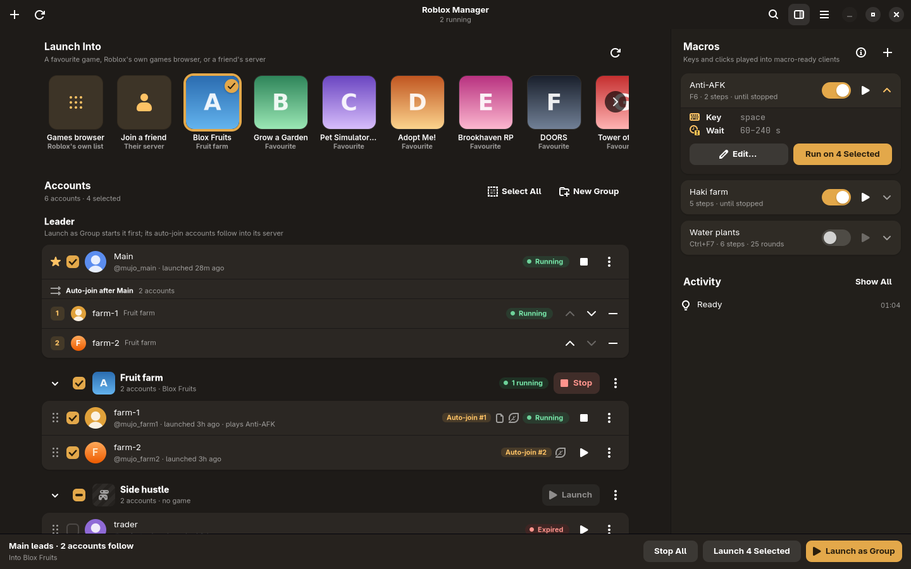
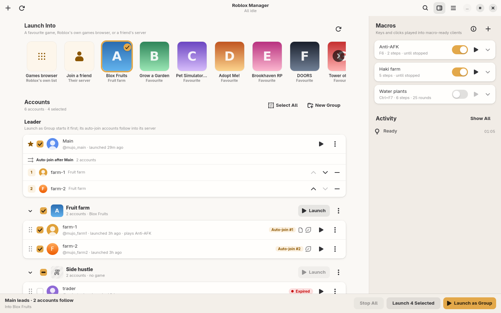

# roblox-manager

Several Roblox accounts, launched into one server.



Roblox runs in Cordial, an open-source runtime for Roblox's official Android
build — this repo's fork of it, built as two command-line tools the manager
drives: `cordial-run` for each account's client and `cordial-fetch` for the
Roblox build. `cordial/source.json` pins the source, and `cordial/README.md`
says what the manager needs from it and how to move it. One Cordial profile per account; the
manager gives each profile its session and starts it with the game's own deep
link. Nothing is injected into the client. Auth is a `.ROBLOSECURITY` cookie
kept in the Secret Service.

Macros: a "macro-ready" account's client runs in its own nested cage display,
and macros play into it through Wayland's virtual keyboard and pointer —
emulated input, so neither your devices nor the client are touched.

Roblox's rules treat simultaneous clients as a policy violation, and community
reports tie them to anti-cheat flags. The exposure starts when the second
client is launched, which is always an explicit click.

## Use

```bash
nix run .                               # the manager
nix build .#roblox-manager-appimage     # one file for other distros (x86_64)
packaging/flatpak/build.sh              # a Flatpak, installed for this user
```

NixOS: add this flake as an input and import `inputs.roblox-manager.nixosModules.default`.

## The window

A GTK4/libadwaita app in your desktop's light or dark style, or the one
chosen in its main menu.

- **Accounts** sign in with Roblox Quick Login (the add button, Ctrl+N):
  you approve a short code on a device where you are already signed in, and
  no password is typed here. Each row shows its avatar, its state, and
  play/stop; its menu (⋮, or a right click) holds its settings, leader and
  auto-join, groups, sessions, and removing it. Search (Ctrl+F) finds
  accounts by label, Roblox name or note.
- **The leader** launches first; its **auto-join** accounts follow into its
  server, in the order shown. Drag an account onto the leader's card to
  add it, onto a group to move it, or onto another row to reorder.
- **Groups** each have a game: Launch on a group's header sends every
  account in it there.
- **Launch Into** picks where Launch Selected and Launch as Group go: a
  favourite game of any account, Roblox's own games browser, or a friend's
  server.
- **Macros** (the side pane, F9) play keys and clicks into macro-ready
  clients; How Macros Work (F1) explains the steps and their timing.
- **Activity** keeps what happened this run; Ctrl+L shows all of it.

<p>
  
  
</p>

| Keys | Does |
| --- | --- |
| Ctrl+N | Add an account |
| Ctrl+F | Search accounts |
| Ctrl+R, F5 | Check sessions and reload favourites |
| Ctrl+Enter | Launch as group |
| Ctrl+Shift+Enter | Launch selected |
| Ctrl+Shift+. | Stop all |
| Ctrl+Shift+N | New macro |
| F9 | Show or hide the macros pane |
| Ctrl+L | Activity log |
| F1 | How macros work |
| Ctrl+? | Every shortcut, and the macros' hotkeys |

Row and group actions are window actions too, so they can be scripted over
D-Bus (`org.gtk.Actions` on `/io/github/mujo/RobloxManager/window/1`), and a
macro's hotkey can be bound anywhere with
`gapplication action io.github.mujo.RobloxManager run-macro "'NAME'"`.

## Files

Data lives in `~/.local/share/rbxmgr`, `~/.local/share/cordial`,
`~/.config/cordial`, the window's size in `~/.local/state/rbxmgr`, and
(regenerable) game icons, avatars and client logs in `~/.cache/rbxmgr` and
`~/.cache/cordial`.

## Layout

A Rust workspace:

- `crates/core` (`rbxmgr-core`): everything except drawing, one directory per
  area -- `accounts`, `keyring`, `roblox`, `cordial`, `launch`, `macros`. No
  GTK; every seam into the outside world (Secret Service, Roblox's web API,
  processes, the Wayland display) is a trait with a production adapter and
  the one the tests use.
- `crates/app` (`roblox-manager`): the GTK4/libadwaita window on top of it.
  Slow work runs on worker threads; results come back to the main loop.
  `resources/style.css` holds the little the window adds to Adwaita: the
  amber accent, the warm surfaces (`style-dark.css` for the dark style), and
  a few pieces Adwaita has no class for. Every icon is one of Adwaita's
  symbolic icons.

## Checks

```bash
nix develop -c cargo test                              # offline
nix develop -c cargo clippy --all-targets -- -D warnings
nix develop -c cargo fmt --check
```

No source file may pass 600 lines; `crates/core/tests/size_limit.rs` fails
the build when one does.
